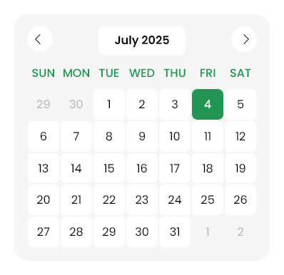
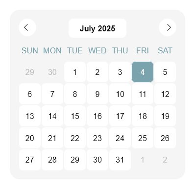
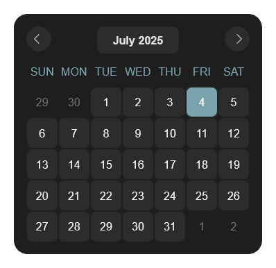

# 📅 Monthly Calendar Widget

A clean, minimalistic monthly calendar widget built with HTML, CSS, and JS — featuring **dark mode support**, **responsive layout**, and a preserved classic calendar structure. Designed to integrate smoothly in Notion dashboards or any personal workspace.

## 🌐 Live Demo  
**[🔗 View Live](https://alestudyhub-calendar.vercel.app/)**

## 📸 Preview  
### Original Version  

### Light Mode  

### Dark Mode  

## ⚙️ Features

- 🌙 **Dark mode aware**: Automatically adapts to user’s device theme
- 🧾 **Clean, compact layout** for dashboards and callouts
- 📆 Full calendar view with dynamic month/year and navigation
- 🖱️ Previous/Next buttons with arrow indicators
- 🎨 `#7ba3ad` color highlight for active elements
- 🧱 Preserves original row spacing and visual layout

## 📦 Based On

This project was originally based on  
[@diptobd71’s Monthly Calendar on CodePen](https://codepen.io/diptobd71/pen/wBBBRxr)  
and has been modified for modern theme compatibility, improved readability, and single-file deployment.
 
