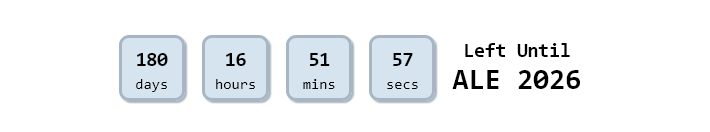
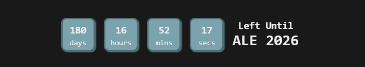

# ⏳ ALE 2026 Countdown Widget

A clean, minimalistic countdown widget built with HTML & CSS — featuring **dark mode support**, **responsive layout**, and carefully styled countdown boxes. Designed to integrate seamlessly in Notion callouts or any dashboard setup.

## 🌐 Live Demo  
**[🔗 View Live](https://alestudyhub-countdown.vercel.app/)**

## 📸 Preview  
### Original Version  

### Light Mode  

### Dark Mode  

## ⚙️ Features

- 🌙 **Dark mode aware**: Automatically adapts to user’s device theme
- 🧾 **Clean design** optimized for Notion embedding
- 🎯 Countdown to **January 1, 2026**
- 🧱 Simple, responsive layout with no scroll
- 🎨 Light/Dark mode specific box and outline colors
- 🧼 Minimal typography and layout spacing

## 📦 Based On

This project was originally based on  
[@Yunzhen-personal’s countdown2](https://yunzhen-personal.github.io/countdown2/)  
and has been modified for dark mode compatibility, cleaner design, and embedded-friendly layout.

