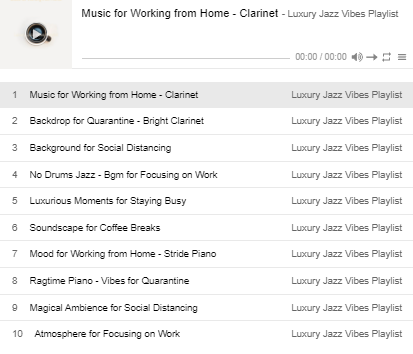
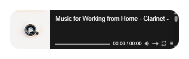

# 🎶 Music Playlist Widget

A minimal, embedded music player widget wrapped in a clean HTML container — designed for **Notion embeds**, **dashboard use**, and **seamless Vercel deployment**. It features a fixed layout, transparent background, and customizable playlist via iframe source.

## 🌐 Live Demo  
**[🔗 View Live](https://alestudyhub-musicplayer.vercel.app/)**

## 📸 Preview  
### Original Embed Source  

### Wrapped Widget – Light Mode  

### Wrapped Widget – Dark Mode  

## ⚙️ Features

- 🧩 **Wrapped iframe** player with consistent layout
- 🖼️ Rounded corners and clean dimensions for embed-friendly design
- 🎛️ Adjustable iframe parameters for playlist ID, theme, volume, etc.
- 🧱 Responsive layout using flexbox
- 🌙 Works with both **light** and **dark** environments (auto or manual theme config)

## 📦 Based On

This widget is a customized wrapper for:  
[@ourongxing’s simple-notion-widgets – Music Player](https://github.com/ourongxing/simple-notion-widgets)  
with modifications for layout consistency, rounded design, and Notion compatibility.
