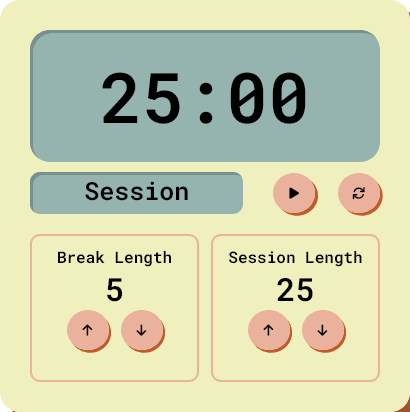
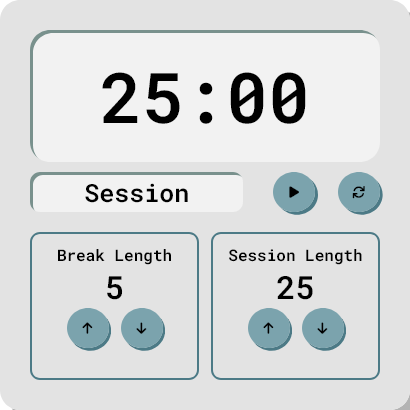
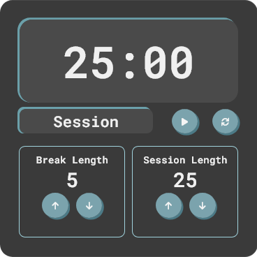

# ⏱️ Pomodoro Timer Widget

A clean, minimalistic Pomodoro timer widget built with HTML & CSS — featuring **dark mode support**, **customizable theme colors**, and a responsive layout. Designed to blend seamlessly with both light and dark environments.

## 🌐 Live Demo
**[🔗 View Live](https://alestudyhub-pomodoro.vercel.app/)**

## 📸 Preview
### Original Version

### Light Mode  

### Dark Mode  

## ⚙️ Features

- 🌙 **Dark mode aware**: Automatically adapts to user’s device theme
- 🎨 **Custom CSS variables** for easy theming
- 🧱 Responsive layout using flexbox
- 🧼 Clean and readable UI
- 🎛️ Session/break timers with increment/decrement controls
- 🎯 Font Awesome icons for control buttons

## 📦 Based On

This project was originally based on [@arcsbstn’s Pomodoro Clock on CodePen](https://codepen.io/arcsbstn/pen/ExEJvxM).  
It has been customized and extended for theme flexibility, design consistency, and modern responsiveness.
